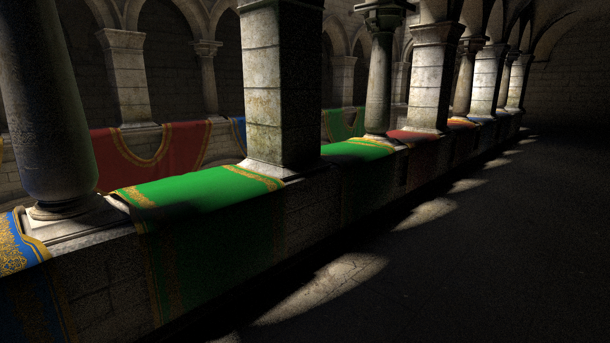
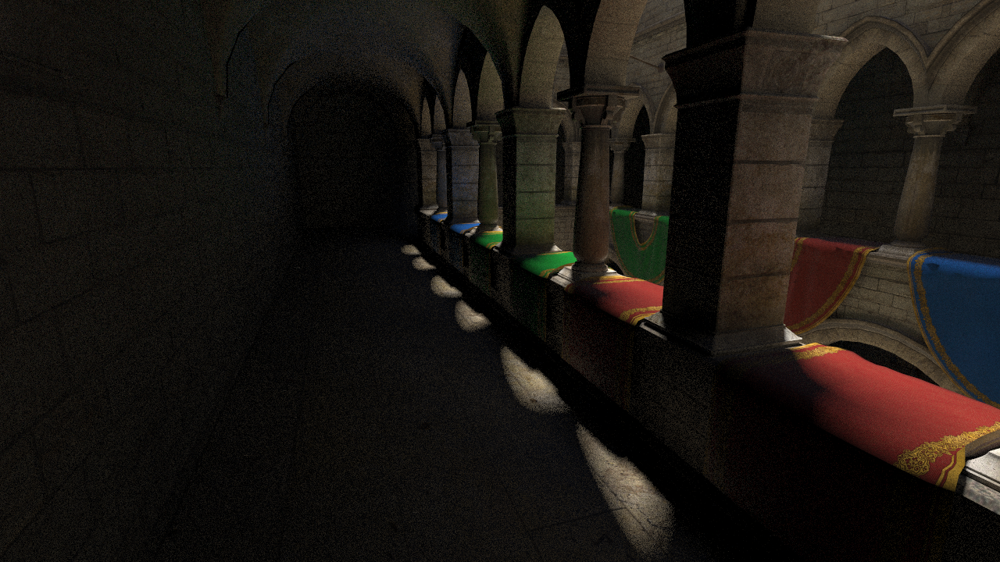
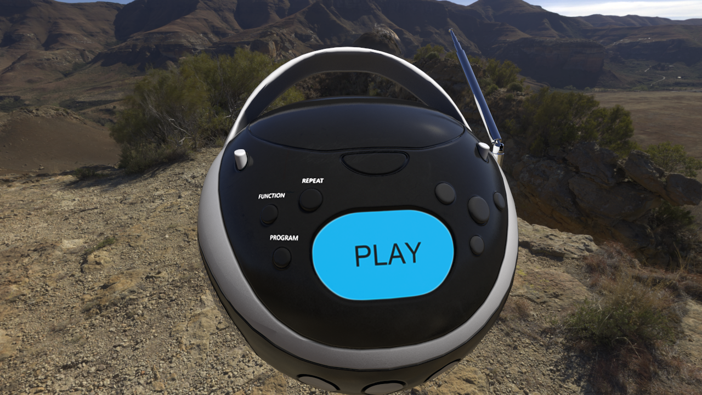
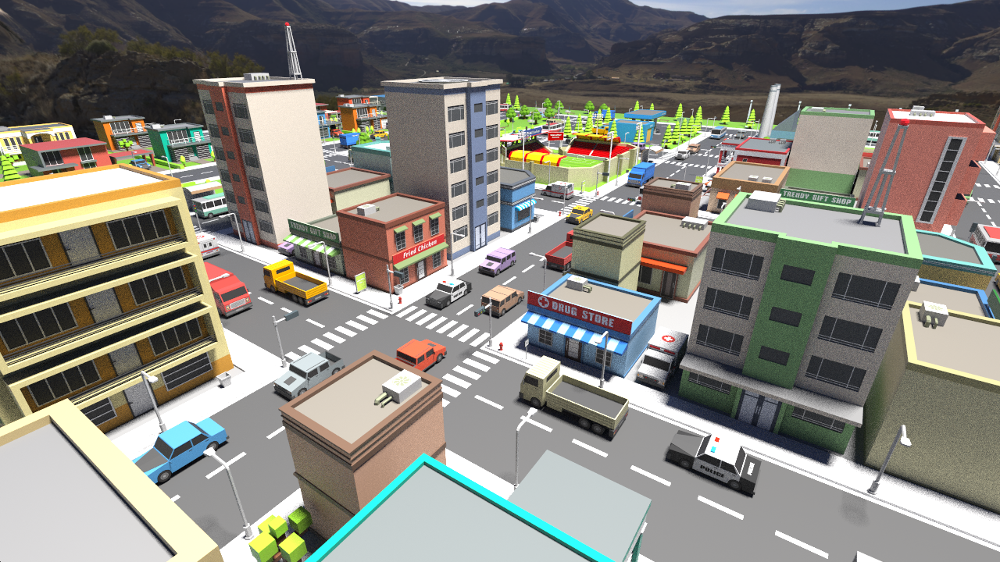
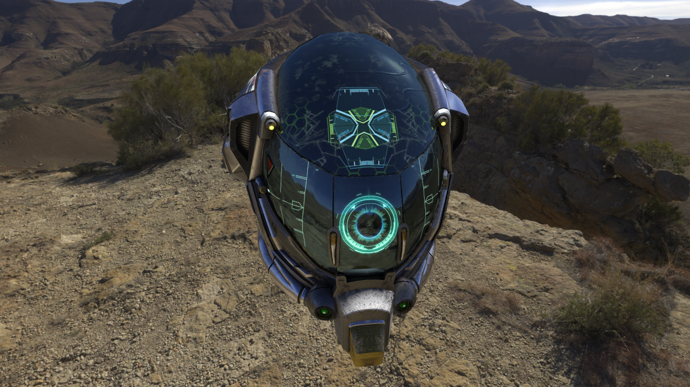

# Satellite OEM (VK-1.1)

> Ray tracing source codes and SDK for making render and game engines (DIY). 

  
  

### Alarm of New dawn... 

* **12.04.2018**. We can no actively support this project. We understand that we will no longer be able to support our old friend for a long time. Despite the adopted amendments to the draft, we understand that we are still weak in competition, and so far we can not enter the final market. We are thinking about creating a radically new project, but so far we do not even know what it will be like ... At first glance, this should be a correction of old and fundamental mistakes. But in our opinion it should be a complete change of the basic concept.
* **02.05.2018**. We made support for nearly all current graphics platforms (2017, 2018 and higher). We now supported in Intel UHD Graphics 630, AMD RX Vega 64 (and may be 56), NVidia GTX 1070 (and may GTX 1080 family).
* **06.05.2018**. We published shaders in standalone repository (https://github.com/world8th/rt-vulkan-shaders). Compatible only with *Vulkan API 1.1*. 
* **14.05.2018**. Updated Vulkan headers and added Volk meta loader. "vulkan.lib" no more required.
* **01.06.2018**. Satellite NEXT (take 2) - https://github.com/world8th/vRt
* **07.06.2018**. This project was more of a mistake. I will sacrifice it to Microsoft, all the developments that are more new and unique, will move to another platform in the near future. I basically still have time, I do not advise other developers to panic, but rather weigh our decisions, all the pros and cons. @elviras9t

### What we can be do, if we had desires

* Appveyor, etc. support 
* Some validation tests
* Suggestion for AMD GPUOpen partnership

### Features from carton box

* Open Source for learning, experiments and forks 
* Based on Vulkan API 1.1 (compute purpose)
* API for vertex data usage and acceleration
* Optimized hlBVH2 acceleration structure 
* Optimized radix-sort (64/4-bits)
* Optimized ray tracing pipeline (tile-based)
* Optimal precision and performance 
* One testing example application (source code)
* Around ~46MRays/s throughput in Sponza scenes (RX Vega 64)
* Windows x64 platform (not UWP), and modern hardwares (NVidia Pascal, Radeon Vega, and beyond) support
* The WOLK graphics standard passing technology!

### Contacts 

* [Our Discord](https://discordapp.com/invite/HFfADHH)
* [Our Reddit](https://www.reddit.com/user/elviras9t/)

### Patreons

* [Make ray-tracing forces with Patreon](https://www.patreon.com/ray_tracing_forces)

### Minimal requirement for minimal product

* Windows platform with IDE (Visual Studio 2017 and higher)
* GLM (https://github.com/g-truc/glm)
* Vulkan API 1.1 (https://www.lunarg.com/vulkan-sdk/)
* Vulkan memory allocator (https://github.com/GPUOpen-LibrariesAndSDKs/VulkanMemoryAllocator)

### Videos 

Coming soon new videos...
